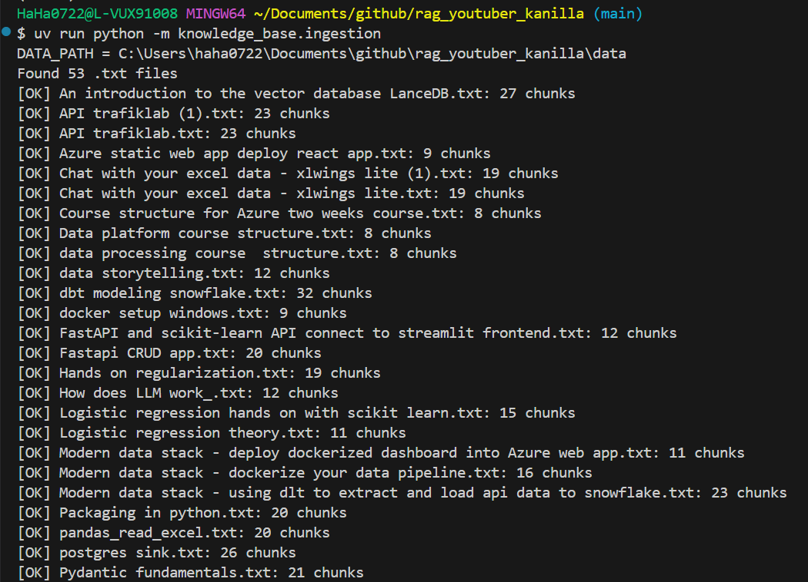
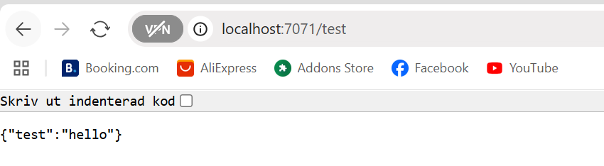
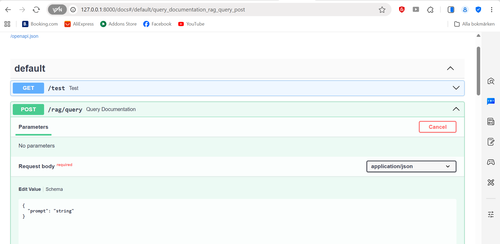
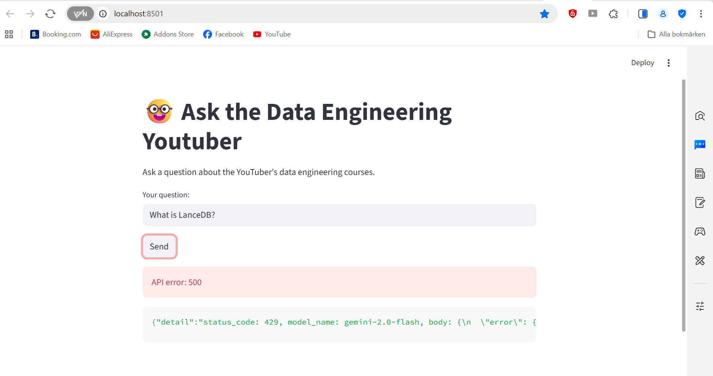

# rag_youtuber_kanilla

RAG Youtuber – AI-chattbot för data engineering

This project is a Retrieval Augmented Generation (RAG) proof‑of‑concept for a data‑engineering YouTuber. The goal is to let students ask questions about YouTube video transcripts and get answers grounded in the actual content.

The system ingests video transcripts, stores embeddings in a vector database (LanceDB), retrieves relevant chunks for a question, and uses an LLM (Gemini) to generate answers only from the retrieved context.

Architecture Overview

Flow:

Markdown transcripts → converted to plain text

Text chunks → embeddings (Gemini embeddings)

Embeddings + metadata → LanceDB (vector database)

User question → similarity search in LanceDB

Retrieved context → LLM (Gemini) → grounded answer

API served with FastAPI

FastAPI wrapped in Azure Functions (serverless)

Task 0 – Data Ingestion (Mandatory)

We start by understanding the dataset and building a knowledge base.

What was done

Markdown (.md) transcripts were converted to .txt

Text was chunked with overlap

Each chunk was embedded using models/text-embedding-004

Chunks + metadata stored in LanceDB

Result

53 transcript files ingested

824 total text chunks stored in LanceDB

Verification:
uv run python - <<'PY'
import lancedb
from backend.config import settings

db = lancedb.connect(str(settings.lancedb_dir))
t = db.open_table(settings.lancedb_table)
print("rows:", t.count_rows())
print("schema:", t.schema)
PY

💯 Successful ingestion logs

LanceDB schema with embedding size 768
💯 [alt text](image-1.png)

Task 1 – Build the RAG (Mandatory)

The RAG pipeline retrieves relevant transcript chunks and generates answers grounded in them.

What was done

Implemented a retriever using LanceDB vector search

Formatted retrieved chunks into a strict context block

Built a Gemini‑based RAG agent with a YouTuber‑style system prompt

Forced answers to rely only on transcript context

Included source references (file + chunk index)

Screenshot

💯[alt text](image-2.png)

💯💯CLI query execution

Retrieved chunks printed

Task 2 – Serve the RAG with FastAPI (Mandatory)

The RAG system is exposed through a REST API.

Endpoints
GET /test
POST /rag/query

Example request:
curl -X POST http://127.0.0.1:8000/rag/query \
-H "Content-Type: application/json" \
-d '{"prompt":"What is LanceDB?"}'

Screenshot

💯 [alt text](image-3.png)

/test returning { "test": "hello" }
💯
💯

Task 3 – Serverless Deployment with Azure Functions (Mandatory)

FastAPI is wrapped inside Azure Functions using ASGI middleware.

Key points

Single catch‑all route: /{*path}

Azure Functions v2 programming model

Local execution with func start

Run locally: func start

Test via Azure Functions runtime: curl http://localhost:7071/test

Screenshot

💯
💯

Azure Functions startup logs
💯

Registered function: fastapi_proxy

⚠️ Known Issue – Gemini API Quota / API Key Error

During testing, the Gemini free‑tier quota was exhausted.

Error example: 
{
"status_code": 429,
"status": "RESOURCE_EXHAUSTED",
"message": "You exceeded your current quota"
}

Important notes

This error is not caused by the code or architecture

The full pipeline works end‑to‑end (request reaches Gemini)

/test endpoint confirms API and Azure Functions are healthy

Screenshot

💯💯💯

/rag/query returning 429 quota error

Task 5 – README (Mandatory)

This README documents:

Project purpose

Architecture

All mandatory tasks

Known limitations

Screenshots should be added for each task to visually demonstrate correctness.

Task 6 – Video Pitch (Mandatory)

A 5–10 minute demo video should include:

Short walkthrough of repository structure

Explanation of RAG architecture

Live demo of /test endpoint

Explanation of Gemini quota limitation

Tech Stack

Python 3.11

FastAPI

LanceDB

Gemini API (Google)

PydanticAI

Azure Functions

How to Run Locally (Quick Start)
# create venv
python -m venv .venv
source .venv/Scripts/activate

# install deps
pip install -r requirements.txt

# start API locally
uv run uvicorn knowledge_base.api:app --reload

# or start Azure Functions
func start

Final Notes

This project demonstrates a complete RAG pipeline from raw transcripts to a serverless API. Even with LLM quota limitations, the system architecture, ingestion, retrieval, and serving layers are fully implemented and working.